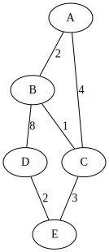

# Minimum Spanning Tree (MST) – Assignment 3

**Course:** Design and Analysis of Algorithms  
**Topic:** Minimum Spanning Tree (Prim's & Kruskal's Algorithms)  
**Language:** Java (Maven Project)  
**Student:** Nurhan Turganbek

##  Project Description

This project implements two classical algorithms for finding the **Minimum Spanning Tree (MST)** in a weighted, undirected graph:
- **Prim’s Algorithm**
- **Kruskal’s Algorithm**

The program reads graph data from `input.json`, constructs MSTs using both algorithms, and writes results to `output.json`.  


## Repository Structure

```
DAA3Assignment/
├── pom.xml
├── src/
│   ├── main/
│   │   ├── java/mst/
│   │   │   ├── MSTMain.java
│   │   │   ├── Graph.java
│   │   │   ├── Edge.java
│   │   │   ├── MSTResult.java
│   │   │   ├── PrimAlgorithm.java
│   │   │   └── KruskalAlgorithm.java
│   │   └── resources/
│   │       └── input.json
│   └── test/
│       └── java/mst/
│           └── MSTTest.java
└── README.md

```

## How to Run

###  Run from IntelliJ IDEA
1. Open the project in **IntelliJ IDEA**.  
2. Make sure the **SDK** is set (Java 23 or compatible).  
3. Run the `MSTMain` class.  
4. The program will:
   - Read data from `src/main/resources/input.json`
   - Generate MSTs using Prim’s and Kruskal’s algorithms
   - Write results to `src/main/resources/output.json`


## Input Format (`input.json`)

```json
{
  "graphs": [
    {
      "id": 1,
      "name": "Small Graph",
      "nodes": ["A", "B", "C", "D", "E"],
      "edges": [
        {"from": "A", "to": "B", "weight": 2},
        {"from": "A", "to": "C", "weight": 4},
        {"from": "B", "to": "C", "weight": 1},
        {"from": "B", "to": "D", "weight": 8},
        {"from": "C", "to": "E", "weight": 3},
        {"from": "D", "to": "E", "weight": 2}
      ]
    }
  ]
}
````


## Output Format (`output.json`)

```json
{
  "results": [
    {
      "graph_id": 1,
      "input_stats": {
        "vertices": 5,
        "edges": 6
      },
      "prim": {
        "mst_edges": [
          {"from": "A", "to": "B", "weight": 2},
          {"from": "B", "to": "C", "weight": 1},
          {"from": "C", "to": "E", "weight": 3},
          {"from": "D", "to": "E", "weight": 2}
        ],
        "total_cost": 8,
        "operations_count": 4,
        "execution_time_ms": 44.76
      },
      "kruskal": {
        "mst_edges": [
          {"from": "B", "to": "C", "weight": 1},
          {"from": "A", "to": "B", "weight": 2},
          {"from": "D", "to": "E", "weight": 2},
          {"from": "C", "to": "E", "weight": 3}
        ],
        "total_cost": 8,
        "operations_count": 4,
        "execution_time_ms": 1.85
      }
    }
  ]
}
```


.svg)

.svg)


## Automated Tests (JUnit 5)

Automated tests in `MSTTest.java` verify:

### Correctness

* Both algorithms return identical total MST cost
* Each MST has `V - 1` edges
* MST is acyclic and fully connected
* Disconnected graphs are handled properly

### Performance & Consistency

* Execution time ≥ 0
* Operation count ≥ 0
* Same input → same MST output

To run tests:
directly from IntelliJ → Right-click `MSTTest` → **Run 'MSTTest'**


## Example Performance Summary

| Graph ID | Vertices | Edges | Prim Time (ms) | Kruskal Time (ms) | Total Cost |
| -------- | -------- | ----- | -------------- | ----------------- | ---------- |
| 1        | 5        | 6     | 44.76          | 1.85              | 8          |
| 2        | 12       | 12    | 0.23           | 0.13              | 48         |
| 3        | 20       | 19    | 0.43           | 0.08              | 90         |

---

## Dependencies

```xml
<dependencies>
    <dependency>
        <groupId>com.google.code.gson</groupId>
        <artifactId>gson</artifactId>
        <version>2.10.1</version>
    </dependency>

    <dependency>
        <groupId>org.junit.jupiter</groupId>
        <artifactId>junit-jupiter</artifactId>
        <version>5.9.3</version>
        <scope>test</scope>
    </dependency>
</dependencies>
```


